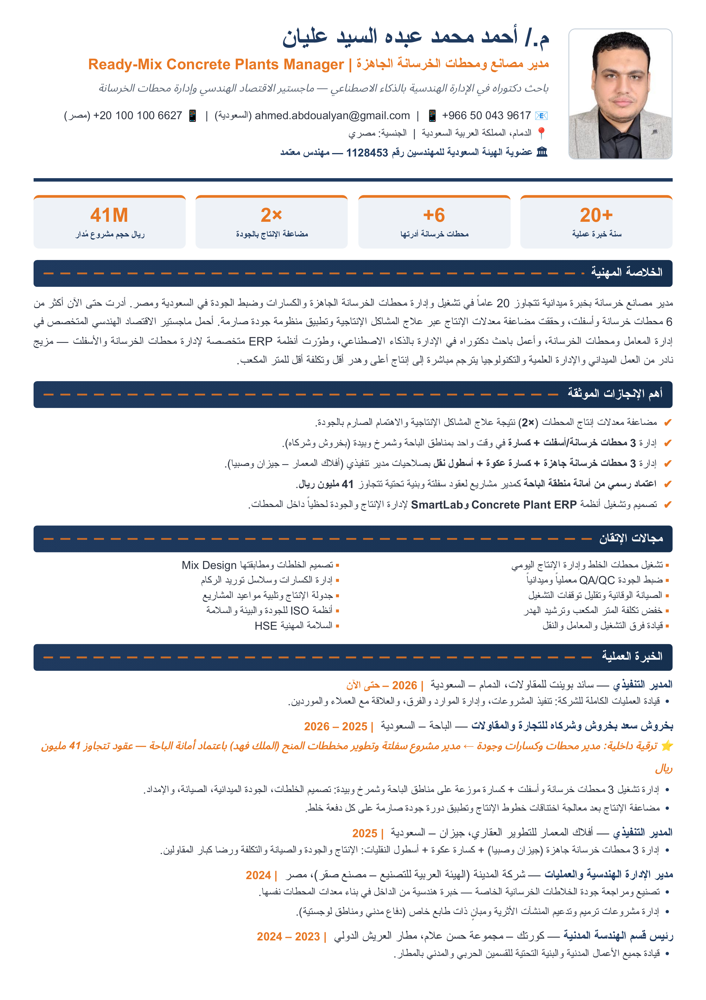
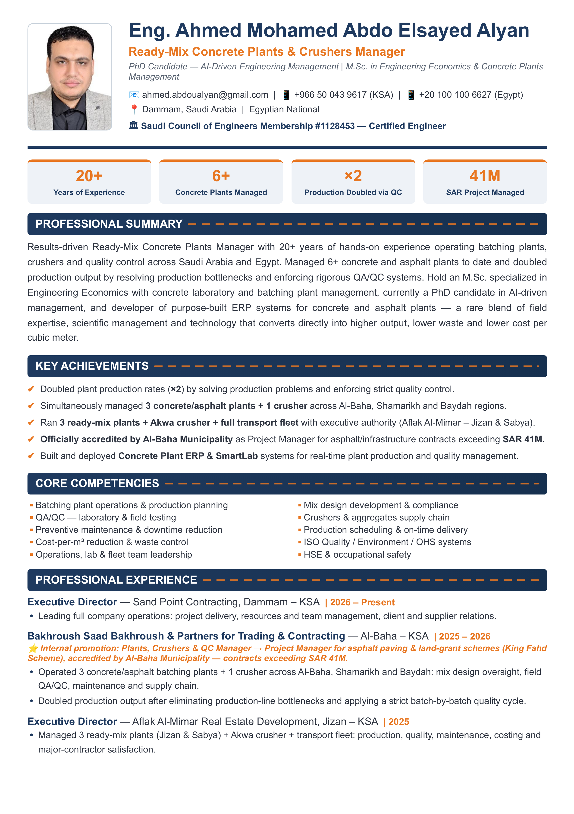

# 🤖 CvAgent — Smart Job Application Agent + Ready-Mix Concrete Plants Manager CV

> **Eng. Ahmed Mohamed Abdo Elsayed Alyan**
> Ready-Mix Concrete Plants & Crushers Manager | M.Sc. Engineering Economics | PhD Candidate (AI-Driven Management)
> 📍 Dammam, Saudi Arabia — 📧 ahmed.abdoualyan@gmail.com — 📱 +966 50 043 9617

This repository contains three things:

1. **[`cv/`](cv/)** — my complete professional CV package (Arabic + English), designed to target **Ready-Mix Concrete Plants & Crushers Management** roles.
2. **[`job-agent/`](job-agent/)** — a Python AI agent that **auto-fills Workday job application forms** using Playwright + Groq LLM, driven by a structured `profile.json`.
3. **[`browser-extension/`](browser-extension/)** — 🧩 **NEW:** the same agent as a **Chrome/Edge extension** with an ON/OFF button that lives inside *your* browser — click the floating orange pill on any application page and watch it fill text fields, dropdowns, radios, screening questions and calendar pickers in real time.

---

## 📄 The CV (`cv/`)

| File | Description |
|---|---|
| [`CV_Ahmed_Alyan_AR.pdf`](cv/CV_Ahmed_Alyan_AR.pdf) | السيرة الذاتية — عربي (صفحتين) |
| [`CV_Ahmed_Alyan_EN.pdf`](cv/CV_Ahmed_Alyan_EN.pdf) | Curriculum Vitae — English (2 pages) |
| `CV_Ahmed_Alyan_Concrete_Plants_AR/EN.docx` | Editable Word versions |
| [`images/`](cv/images/) | High-res page snapshots (300 DPI, PNG + JPG) for job portals |
| [`Preview_English.html`](cv/Preview_English.html) / [`معاينة_عربي.html`](cv/معاينة_عربي.html) | Browser-printable HTML source |
| [`job_post.txt`](cv/job_post.txt) | Ready-made announcement posts (LinkedIn / Facebook / Telegram) |

### Key highlights
- ✅ **20+ years** operating concrete batching plants, crushers & QA/QC across KSA & Egypt
- ✅ **6+ plants managed** — including 3 plants + 1 crusher *simultaneously*
- ✅ **Doubled plant output (×2)** by fixing production bottlenecks + strict QC
- ✅ **SAR 41M+** projects — accredited Project Manager by Al-Baha Municipality
- ✅ M.Sc. in Engineering Economics *(Concrete/Batching Plants Management)*, GPA 3.67
- ✅ PhD candidate — AI-Driven Engineering Management
- ✅ Built his own **Concrete Plant ERP** & **SmartLAB** → [concrete.fimtosoft.com](https://concrete.fimtosoft.com)
- ✅ SCE Certified Engineer (#1128453) — ISO 9001/14001/45001 Internal Auditor

### CV preview (page 1)
<p align="center">
  
  
</p>

---

## 🤖 The Agent (`job-agent/`)

A smart, LLM-driven form filler built specifically for **Workday** career portals:

```
Open application URL → stealth browser (anti-bot)
        ↓
extract every visible field (<input>/<textarea>/<select> + labels)
        ↓
send fields + profile.json → Groq LLM (llama-3.3-70b, temp=0, JSON mode)
        ↓
LLM returns strict JSON: {"actions":[{"index":3,"action":"fill","value":"..."}]}
        ↓
execute: fill / select / custom Workday dropdown / checkbox — with retries
        ↓
screening questionnaires: LLM reads the QUESTION text (fieldset legend /
ARIA group labels) and answers truthfully from profile.booleans
        ↓
auto-click "Next" through pages → STOP at final review (you press Submit)
```

### Quick start
```bash
cd job-agent
python3 -m venv .venv && source .venv/bin/activate
pip install -r requirements.txt
playwright install chromium

export GROQ_API_KEY="gsk_..."          # free key: console.groq.com/keys
python agent.py "https://company.wd3.myworkdayjobs.com/..." --max-pages 25
```

### 🔒 Private data policy
The public `profile.json` ships **without** the iqama number. To use the agent
on real applications, create your private overlay (it is git-ignored):

```bash
cp profile.json profile.local.json
# edit profile.local.json → ids.iqama_number = "2xxxxxxxx"
python agent.py "<url>"     # profile.local.json is auto-merged at runtime
```

Full documentation: [`job-agent/README.md`](job-agent/README.md)

---

## 🛠 Tech stack

`Python 3.10+` · `Playwright (async)` · `httpx` · `Groq API (llama-3.3-70b-versatile)` · `JSON-mode prompting`

## ⚠️ Disclaimer

This agent automates filling *your own* job applications with *your own* data.
Always review the final page before submitting — the agent stops there on purpose.
